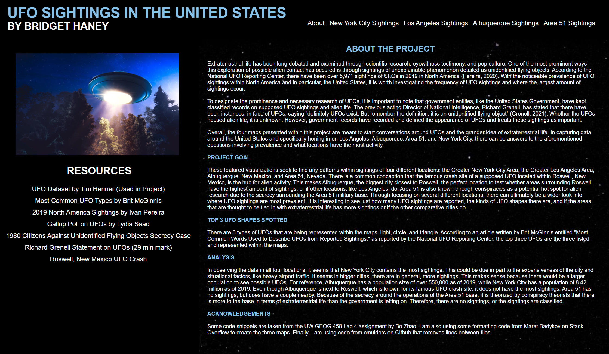
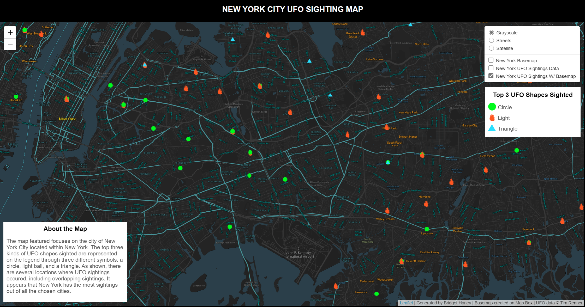

# UFO Sightings Visualization

**FIGURE 1.** An overall look at the project and its visualizations.

### THE PROJECT

**Map:** [UFO Sightings Map](https://bridgethaney.github.io/UFO_Sightings_Project/)

**Data:** [UFO Sightings Dataset](https://data.world/timothyrenner/ufo-sightings) by Tim Renner

### INTRODUCTION

Extraterrestrial life has been long debated and examined through scientific research, eyewitness testimony, and pop culture. According to the National UFO Reporting Center, there have been over 5,971 sightings of UFOs in 2019 in North America (Pereira, 2020). With the noticeable 

### PROJECT GOAL

This featured visualization seeks to find any patterns within sightings of three different locations: the Greater Los Angeles Area, Albuquerque, New Mexico, and the Greater New York City Area. There is a common conception that Area 51, which is located within Roswell, New Mexico, is the hub for alien activity. This makes Albuquerque, the biggest city closest to Roswell, the perfect location to test whether areas next to the most known. Through focusing on several different locations, there can ultimately be a wider look into where UFO sightings are most prevalent. It is interesting to see just how many reported 

### ANALYSIS

In observing the data in all three locations, it seems that New York City contains the most sightings.

### TECHNICAL OVERVIEW

- **UFO Sightings Map**
    - Layers
        - Basemap: Customized Monochrome Basemap made on MapBox
        - Thematic layer: UFO Sightings Data with colors of symbols changing based on shape type of UFO
        - Basemap w/ Thematic Layer: Combines both the basemap and UFO data for ease of access
    - Libraries
        - Leaflet 

- **Methodology**
    - QMetaTiles was used to create all three maps. Importing the custom night view basemap into QGIS, the basemap, 
        
- **Data Resources:**
    - [UFO Sightings Dataset](https://data.world/timothyrenner/ufo-sightings) by Tim Renner
    - [UFO Sightings in North America](https://abcnews.go.com/US/ufo-sightings-north-america-jumped-6000-2019/story?id=68145474) by Ivan Pereira

### GUIDE

#### **New York City Map**

#### **Albuquerque Map**

#### **Los Angeles Map**

#### **Legend: Shapes of UFOs**
   - Each UFO shape is represented by a color symbol on the map
   - The types of shapes are: Love, Changing, Chevron, Circle, Cone, Cross, Cylinder, Diamond, Disk, Egg, Fireball, Flash, Formation, Light, Other, Oval, Rectangle, Sphere, Teardrop, and Triangle
    

## Acknowledgements

Some code snippets are taken from the UW GEOG 458 Lab 4 assignment by Bo Zhao. I am also using some formatting code from Marat Badykov on Stack Overflow to create the three maps.

## References

