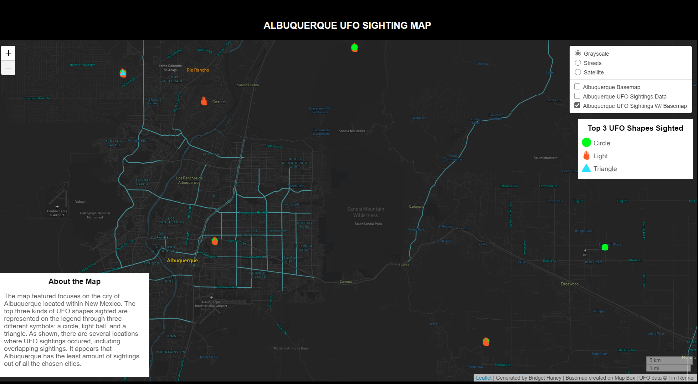

# UFO Sightings in the United States

**FIGURE 1.** An overall look at the project and its visualizations.

### THE PROJECT

**Map Project:** [UFO Sightings Maps](https://bridgethaney.github.io/UFO_Sightings_Project/)

**Data:** [UFO Sightings Dataset](https://data.world/timothyrenner/ufo-sightings) by Tim Renner

### INTRODUCTION

Extraterrestrial life has been long debated and examined through scientific research, eyewitness testimony, and pop culture. One of the most prominent ways this exploration of possible alien contact has occured is through sightings of unexplainable phenomena detailed as unidentified flying objects. According to the National UFO Reporting Center, there have been over 5,971 sightings of UFOs in 2019 in North America (Pereira, 2020). With the noticeable prevalence of UFO sightings within North America and in particular, the United States, it is worth investigating the frequency of UFO sightings and where the largest amount of sightings occur.

To designate the prominance and necessary research of UFOs, it is important to note that government entities, like the United States Government, have kept classified records on supposed UFO sightings and alien life. The previous acting Director of National Intelligence, Richard Grenell, has stated that there have been instances, in fact, of UFOs, saying "definitely UFOs exist. But remember the definition, it is an unidentified flying object" (Grenell, 2021). Whether the UFOs housed alien life, it is unknown. However, government records have recorded and defined the appearance of UFOs and treats these sightings as important.

This involvement of the government has led to deeper rooted effects that impact the mindset of the public surrounding UFO sightings. It is shown that the "68% today who believe the government is withholding information about UFOs is comparable to the 71% found in 1996" (Saad, 2021). This means that due to possible UFO sightings, individuals may believe that the government is not being transparent or hiding information about UFOs or possible alien life, signifying a growing distrust with the government. In 1980 especially, the National Security Agency was involved in a civil action case entitled "Citizens Against Unidentified Flying Objects Secrecy v. National Security Agency," in which the public demanded that the government be more transparent and upfront about UFOs.

Overall, the four maps presented within this project are meant to start conversations around UFOs and the grander idea of extraterrestrial life. In capturing data around the United States and specifically honing in on Los Angeles, Albuquerque, Area 51, and New York City, there can be answers to the aforementioned questions involving prevalence and what locations have the most activity.

### PROJECT GOAL

These featured visualizations seek to find any patterns within sightings of four different locations: the Greater New York City Area, the Greater Los Angeles Area, Albuquerque, New Mexico, and Area 51, Nevada. There is a common conception that the famous crash site of a supposed UFO located within Roswell, New Mexico, is the hub for alien activity. This makes Albuquerque, the biggest city closest to Roswell, the perfect location to test whether areas surrounding Roswell have the highest amount of sightings, or if other locations, like Los Angeles, do. Area 51 is also known through conspiracies as a potential hot spot for alien research due to the secrecy surrounding the Area 51 military base. Through focusing on several different locations, there can ultimately be a wider look into where UFO sightings are most prevalent. It is interesting to see just how many UFO sightings are reported, the kinds of UFO shapes there are, and if the areas that are thought to be tied in with extraterrestrial life have more sightings or if the other comparative cities do.

**Audience:** There are several different types of audiences that would benefit from this information. Ufologists are the prime target for this research. A Ufologist is an individual that specifically studies and identifies UFOs. Government entities can also use this map to figure out which locations to focus on when trying to conduct research or create reports on sightings. Finally, the general public interested in UFOs can use this data to see where UFOs are located and what kind of UFOs are sighted.

### TOP 3 UFO SHAPE TYPES

There are 3 types of UFOs that are being represented within the maps: light, circle, and triangle. According to an article written by Brit McGinnis entitled "Most Common Words Used to Describe UFOs from Reported Sightings," as reported by the National UFO Reporting Center, the top three UFOs are the three listed and represented within the maps.

### ANALYSIS

In observing the data in all four locations, it seems that New York City contains the most sightings. This could be due in part to the expansiveness of the city and situational factors, like heavy airport traffic. It seems in bigger cities, there are in general, more sightings. This makes sense because there would be a larger population to see possible UFOs. For reference, Albuquerque has a population size of over 550,000 as of 2019, while New York City has a population of 8.42 million as of 2019. Even though Albuquerque is next to Roswell, which is known for its famous UFO crash site, it does not have the most sightings. Area 51 has no sightings, but does have a couple nearby. Because of the secrecy around the operations of the Area 51 base, it is theorized by conspiracy theorists that there is more to the base in terms of extraterrestrial life than the government is letting on. Therefore, there are no sightings, or the sightings are classified.

### TECHNICAL OVERVIEW

- **UFO Sightings Map**
    - Layers
        - Basemap: Customized Monochrome Basemap made on MapBox
        - Thematic layer: UFO Sightings Data with colors of symbols changing based on shape type of UFO
        - Basemap w/ Thematic Layer: Combines both the basemap and UFO data for ease of access
    - Libraries / Packages
        - Leaflet: Creates the maps
        - QMetaTiles: Package on QGIS that converts maps to 256 pixel tiles
    - Host
        - Github is hosting the code and Github-pages is hosting the website

- **Methodology and Steps**
    - First, the basemap was created within Map Box. The base colors were darker grays, while location labels and streets were given light blues, greens, yellows, and oranges depending on zoom.
    - The thematic layer was then acquired. The UFO dataset by Tim Renner, which is found on the website data.world, contains information on UFO sightings. On the map, the data points are represented by shapes that are coordinated to the shape of the UFO sighted.
    - The basemap, thematic layer, and both the basemap and thematic layer together are converted to 256 pixel tiles through QMetaTiles on QGIS. This allows for visually-appealing design and more quick display of information.
        
- **Resources:**
    - [UFO Sightings Dataset](https://data.world/timothyrenner/ufo-sightings) by Tim Renner
    - [Three Maps on Leaflet](https://stackoverflow.com/questions/52597399/displaying-3-leaflet-maps-on-same-page) as explained by Marat Badykov

### GUIDE

#### **New York City Map**

**FIGURE 2: Static image of the interactive leaflet map featuring New York City UFO sightings**

#### **Albuquerque Map**

**FIGURE 3: Static image of the interactive leaflet map featuring Albuquerque UFO sightings**

#### **Los Angeles Map**

**FIGURE 4: Static image of the interactive leaflet map featuring Los Angeles UFO sightings**

#### **Area 51 Map**

**FIGURE 5: Static image of the interactive leaflet map featuring Area 51 UFO sightings**

#### **Legend: Shapes of UFOs**
   - Each UFO shape is represented by a color symbol on the map
   - There are 21 shapes featured in the data, but only the top three most seen shape types are chosen to be represented in the map
   - The three shapes that are represented in the visualizations are circle, light, and triangle
    

## Acknowledgements

Some code snippets are taken from the UW GEOG 458 Lab 4 assignment by Bo Zhao. I am also using some formatting code from Marat Badykov on Stack Overflow to create the three maps. Finally, I am using code from cmulders on Github that removes lines between tiles.

## References

Mcginnis, B. (n.d.). Most common words used to describe UFOs from reported sightings. Retrieved March 19, 2021, from https://stacker.com/stories/3253/most-common-words-used-describe-ufos-reported-sightings

Declassified Documents: UFOs. (n.d.). Retrieved March 16, 2021, from https://www.nsa.gov/news-features/declassified-documents/ufo/

Hard Factor 7/21/20: Interview with Ric Grenell Former Director of National Intelligence. (2020, July 21). Retrieved March 19, 2021, from https://www.youtube.com/watch?v=ElEW16zOgwM

History.com Editors. (2009, November 09). Roswell. Retrieved March 19, 2021, from https://www.history.com/topics/paranormal/roswell

Pereira, I. (2020, January 8). UFO sightings in North America jumped to nearly 6,000 in 2019. Retrieved March 16, 2021, from https://abcnews.go.com/US/ufo-sightings-north-america-jumped-6000-2019/story?id=68145474

Saad, L. (2021, January 14). Americans Skeptical of UFOs, but Say Government Knows More. Retrieved from https://news.gallup.com/poll/266441/americans-skeptical-ufos-say-government-knows.aspx

Schonfeld, A. (2020, July 02). Inside the mysterious Area 51: Aliens, UFOs, conspiracies and More. Retrieved March 19, 2021, from https://www.newsweek.com/inside-mysterious-area-51-aliens-ufos-conspiracies-more-1514362

